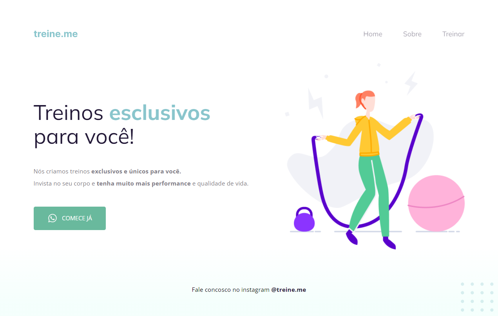

## TREINE ME

Projeto desenvolvido no curso Explorer da Rocketseat, muito parecido com anterior, Móveis Customizados. Porém com alguns novos desafios, como o bottom, o gradiante, entre outros.

[🔗Clique aqui para acessar](https://lorenalopesm.github.io/treine-me)

## 🛠️ Tecnologias 
- HTML
- CSS
- Git e GitHub

## 📚 O que aprendi
Neste projeto me aprofundei mais nas ferramentas do HTML, como o header e nav. E aprendi a colocar termos de semântica e acessibilidade.
No CSS aprendi um pouco mais sobre justify-content, opacity e o background: linear-gradient.

## ✉️ Contato
linkedin.com/in/lorena-lopes-de-macedo
lore.lopees@outlook.com
